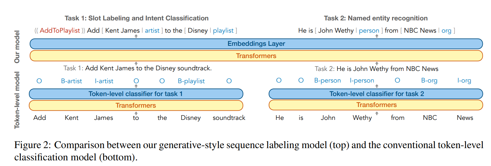
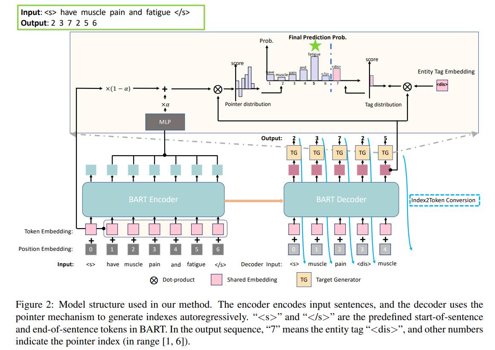
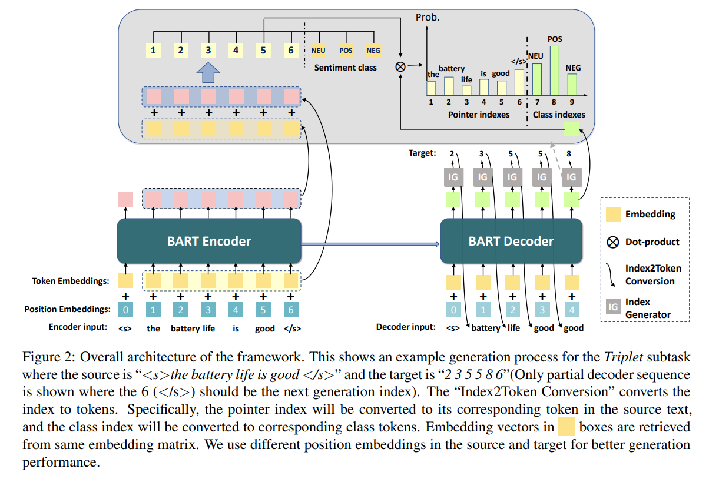
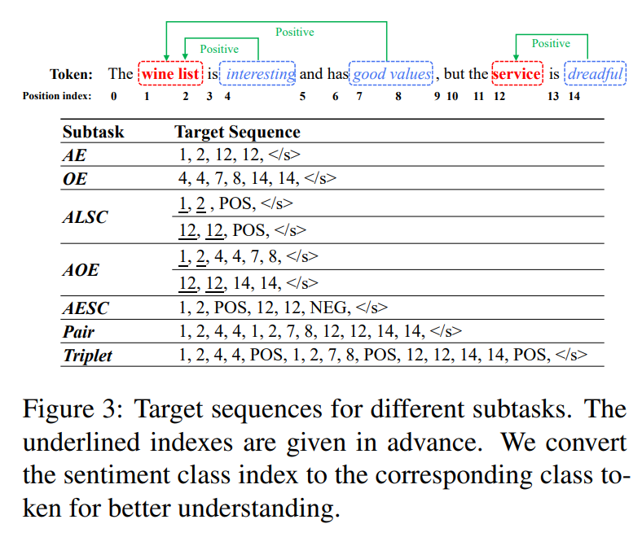

# GenKBP_Papers

### Label-augmented Text
- [Structured Prediction as Translation between Augmented Natural Languages](https://openreview.net/pdf?id=US-TP-xnXI) 

- [Augmented Natural Language for Generative Sequence Labeling](https://aclanthology.org/2020.emnlp-main.27.pdf)

### Generating Word Indices

- [A Unified Generative Framework for Various NER Subtasks](https://aclanthology.org/2021.acl-long.451.pdf)

- [A Unified Generative Framework for Aspect-Based Sentiment Analysis](https://aclanthology.org/2021.acl-long.188.pdf)

- [Don’t Parse, Generate! A Sequence to Sequence Architecture for Task-Oriented Semantic Parsing](https://dl.acm.org/doi/pdf/10.1145/3366423.3380064)

### Generating Answers

### Filling Templates

### Structurelinearized Texts

### Non-autogressive

### Combinations

### Ranking Inputoutput Pairs

