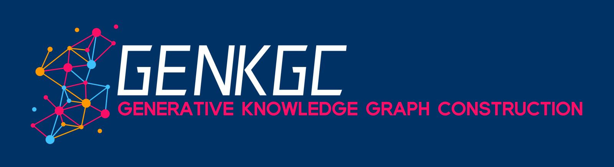
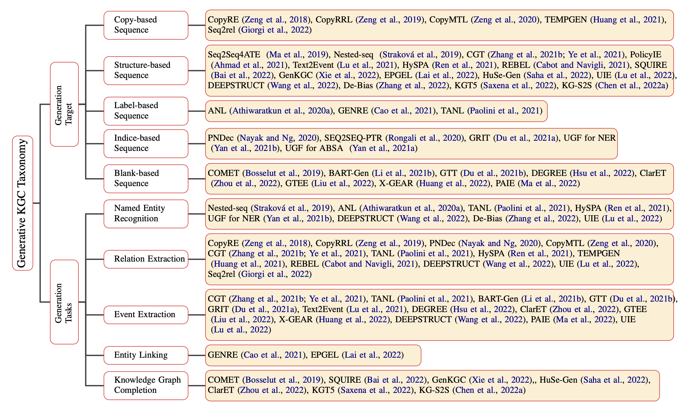
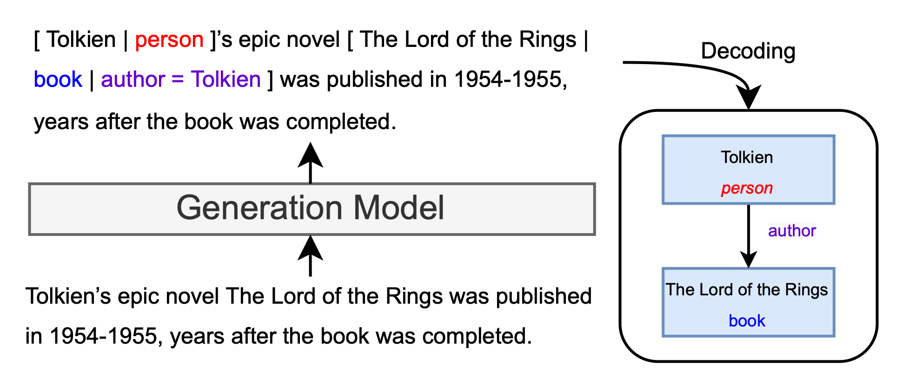
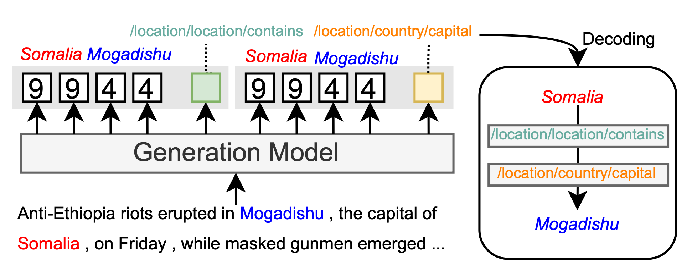
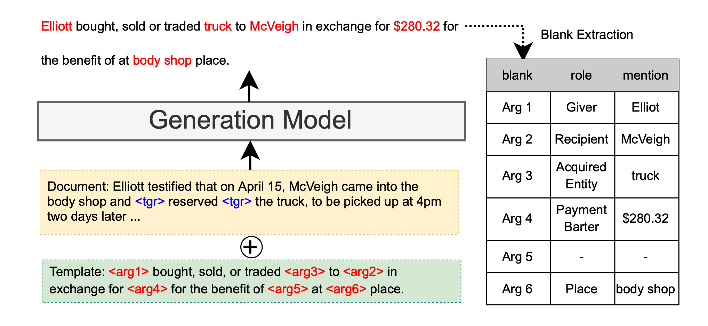

<p align="center">
     
<p>
<!-- 
<h1 align="center">
    <p>Generative Knowledge Graph Construction: A Review</p>
</h1> -->

### 
**[:bell: News! :bell: ]
We have released a new survey paper:"[Generative Knowledge Graph Construction: A Review](https://arxiv.org/pdf/2210.12714.pdf)" based on this repository, with a perspective of existing Generative Knowledge Graph Construction! We are looking forward to any comments or discussions on this topic :)** 

## 🕵️ Introduction
Generative Knowledge Graph Construction (KGC) refers to those methods that leverage the sequence-to-sequence framework for building knowledge graphs, which is flexible and can be adapted to widespread tasks.
In this study, we summarize the recent compelling progress in generative knowledge graph construction. 
We present the advantages and weaknesses of each paradigm in terms of different generation targets and provide theoretical insight and empirical analysis. 
Based on the review, we suggest promising research directions for the future. Our contributions are threefold: (1) We present a detailed, complete taxonomy for the generative KGC methods; 
(2) We provide a theoretical and empirical analysis of the generative KGC methods; 
(3) We propose several research directions that can be developed in the future.
For more resources about knowledge graph construction, please check our tookit [DeepKE](https://github.com/zjunlp/DeepKE).

## *👋 News!*
- We release a prompt&KG paper-list at [PromptKG](https://github.com/zjunlp/PromptKG).
- Congratulations! Our work has been accepted by the EMNLP2022 main conference.
- Due to the rise of generative extraction methods in the NLP community，we summarize recent progress in generative KGC and release our paper  on [arivx](https://arxiv.org/pdf/2210.12714.pdf).


### 🚩Citation 
If you find this survey useful for your research, please consider citing
```
@article{DBLP:journals/corr/abs-2210-12714,
  author    = {Hongbin Ye and
               Ningyu Zhang and
               Hui Chen and
               Huajun Chen},
  title     = {Generative Knowledge Graph Construction: {A} Review},
  journal   = {CoRR},
  volume    = {abs/2210.12714},
  year      = {2022},
  url       = {https://doi.org/10.48550/arXiv.2210.12714},
  doi       = {10.48550/arXiv.2210.12714},
  eprinttype = {arXiv},
  eprint    = {2210.12714},
  timestamp = {Fri, 28 Oct 2022 14:21:57 +0200},
  biburl    = {https://dblp.org/rec/journals/corr/abs-2210-12714.bib},
  bibsource = {dblp computer science bibliography, https://dblp.org}
}
```

## ⚓️ Preliminary on Knowledge Graph Construction

Knowledge Graph Construction mainly aims to extract structural information from unstructured texts, 
such as Named Entity Recognition (NER), Relation Extraction (RE), Event Extraction (EE), Entity Linking (EL), and Knowledge Graph Completion (KGC).

Generally, KGC can be regarded as structure prediction tasks, where a model is trained to approximate a target function $F(x) \rightarrow y$, where $x \in \mathcal{X}$ denotes the input data and $y \in \mathcal{Y}$ denotes the output structure sequence. 
For instance, given a sentence, *"Steve Jobs and Steve Wozniak co-founded Apple in 1977."*: 

- Named Entity Recognition aims to identify the types of entities, i.e., *‘Steve Job'*, *‘Steve Wozniak'* $\Rightarrow$ *PERSON*, *‘Apple'* $\Rightarrow$ *ORG*; 

- Relation Extraction aims to identify the relationship of the given entity pair $\langle$*Steve Job*, *Apple*$\rangle$ as *founder*;

- Event Extraction aims to identify the event type as *Business Start-Org* where *‘co-founded'* triggers the event and (*Steve Jobs*, *Steve Wozniak*) are participants in the event as *AGENT* and *Apple* as *ORG* respectively. 

- Entity Linking aims to link the mention *Steve Job* to *Steven Jobs (Q19837)* on Wikidata, and *Apple* to *Apple (Q312)* as well.

- Knowledge Graph Completion aims to complete incomplete triples $\langle$*Steve Job*, *create*,  *?*$\rangle$ for blank entities *Apple*, *NeXT Inc.* and *Pixar*.


## 🏳‍🌈 A Taxonomy of Current Methods

In this Survey, we summarize recent progress in generative KGC. We propose to organize relevant work by the generation target of models and also present the axis of the task level.


<p align='center'>
    </br>
    
</p>


### 1. Copy-based Sequence.
This paradigm refers to developing more robust models to copy the corresponding entity directly from the input sentence during the generation process. 
As shown in figure, the model copies the head entity from the input sentence and then the tail entity.

<p align='center'>
    </br>
    
</p>

- ***Directly copy entity***
  - **"Extracting Relational Facts by an End-to-End Neural Model with Copy Mechanism"**, ACL 2018
    - Xiangrong Zeng, Daojian Zeng, Shizhu He, Kang Liu, Jun Zhao
    - [[Paper]](https://aclanthology.org/P18-1047/)

  - **"Learning the Extraction Order of Multiple Relational Facts in a Sentence with Reinforcement Learning"**, AAAI 2020
    - Xiangrong Zeng, Shizhu He, Daojian Zeng, Kang Liu, Shengping Liu, Jun Zhao
    - [[Paper]](https://doi.org/10.18653/v1/D19-1035)

  - **"CopyMTL: Copy Mechanism for Joint Extraction of Entities and Relations with Multi-Task Learning"**, EMNLP 2019
    - Daojian Zeng, Haoran Zhang, Qianying Liu
    - [[Paper]](https://ojs.aaai.org/index.php/AAAI/article/view/6495)

  - **"Document-level Entity-based Extraction as Template Generation"**, EMNLP 2021
    - Kung-Hsiang Huang, Sam Tang, Nanyun Peng
    - [[Paper]](https://aclanthology.org/2021.emnlp-main.426/)
    
- ***Restricted target vocabulary***
  - **"A sequence-to-sequence approach for document-level relation extraction"**,  BioNLP 2022
    - John Giorgi, Gary Bader, Bo Wang
    - [[Paper]](https://aclanthology.org/2022.bionlp-1.2/)

### 2. Structure-linearized Sequence.
This paradigm refers to utilizing structural knowledge and label semantics, making it prone to handling a unified output format.
As shown in figure, the output is a linearization of the extracted knowledge structure.
<p align='center'>
    </br>
    
</p>

- ***Per-token tag encoding***
  - **"Exploring Sequence-to-Sequence Learning in Aspect Term Extraction"**, ACL 2019
    - Dehong Ma, Sujian Li, Fangzhao Wu, Xing Xie, Houfeng Wang
    - [[Paper]](https://aclanthology.org/P19-1344/)

  - **"Neural Architectures for Nested NER through Linearization"**, ACL 2019
    - Jana Straková, Milan Straka, Jan Hajic
    - [[Paper]](https://aclanthology.org/P19-1527/)

- ***Faithful contrastive learning***

  - **"Contrastive Triple Extraction with Generative Transformer"**, AAAI 2021
    - Hongbin Ye, Ningyu Zhang, Shumin Deng, Mosha Chen, Chuanqi Tan, Fei Huang, Huajun Chen
    - [[Paper]](https://ojs.aaai.org/index.php/AAAI/article/view/17677/)
  
  - **"Contrastive Triple Extraction with Generative Transformer"**, IEEE ACM Trans. Audio Speech Lang. Process
    - Ningyu Zhang, Hongbin Ye, Shumin Deng, Chuanqi Tan, Mosha Chen, Songfang Huang, Fei Huang, Huajun Chen
    - [[Paper]](https://ieeexplore.ieee.org/document/9537684)

  - **"Explanation Graph Generation via Pre-trained Language Models: An Empirical Study with Contrastive Learning"**, ACL 2022
    - Swarnadeep Saha, Prateek Yadav, Mohit Bansal
    - [[Paper]](https://aclanthology.org/2022.acl-long.85/)
    

- ***Prefix tree constraint decoding***

  - **"Text2Event: Controllable Sequence-to-Structure Generation for End-to-end Event Extraction"**, ACL 2021
    - Yaojie Lu, Hongyu Lin, Jin Xu, Xianpei Han, Jialong Tang, Annan Li, Le Sun, Meng Liao, Shaoyi Chen
    - [[Paper]](https://aclanthology.org/2021.acl-long.217/)

  
- ***Triplet linearization***

  - **"REBEL: Relation Extraction By End-to-end Language generation"**, EMNLP 2021
    - Pere-Lluís Huguet Cabot, Roberto Navigli
    - [[Paper]](https://aclanthology.org/2021.findings-emnlp.204/)

  - **"De-Bias for Generative Extraction in Unified NER Task"**, ACL 2022
    - Shuai Zhang, Yongliang Shen, Zeqi Tan, Yiquan Wu, Weiming Lu
    - [[Paper]](https://aclanthology.org/2022.acl-long.59/)

- ***Entity-aware hierarchical decoding***

  - **"From Discrimination to Generation: Knowledge Graph Completion with Generative Transformer"**, WWW 2022
    - Xin Xie, Ningyu Zhang, Zhoubo Li, Shumin Deng, Hui Chen, Feiyu Xiong, Mosha Chen, Huajun Chen
    - [[Paper]](https://doi.org/10.1145/3487553.3524238)

- ***Unified structure generation***

  - **"Unified Structure Generation for Universal Information Extraction"**, ACL 2022
    - Yaojie Lu, Qing Liu, Dai Dai, Xinyan Xiao, Hongyu Lin, Xianpei Han, Le Sun, Hua Wu
    - [[Paper]](https://aclanthology.org/2022.acl-long.395/)
    
  - **"DeepStruct: Pretraining of Language Models for Structure Prediction"**, ACL 2022
    - Chenguang Wang, Xiao Liu, Zui Chen, Haoyun Hong, Jie Tang, Dawn Song
    - [[Paper]](https://aclanthology.org/2022.findings-acl.67/)


- ***Reformulating triple prediction***

  - **"Intent Classification and Slot Filling for Privacy Policies"**, ACL 2021
    - Wasi Uddin Ahmad, Jianfeng Chi, Tu Le, Thomas Norton, Yuan Tian, Kai-Wei Chang
    - [[Paper]](https://aclanthology.org/2021.acl-long.340/)

  - **"HySPA: Hybrid Span Generation for Scalable Text-to-Graph Extraction"**, ACL 2021
    - Liliang Ren, Chenkai Sun, Heng Ji, Julia Hockenmaier
    - [[Paper]](https://aclanthology.org/2021.findings-acl.356/)

  - **"SQUIRE: A Sequence-to-sequence Framework for Multi-hop Knowledge Graph Reasoning"**, EMNLP 2022
    - Yushi Bai, Xin Lv, Juanzi Li, Lei Hou, Yincen Qu, Zelin Dai, Feiyu Xiong
    - [[Paper]](https://arxiv.org/abs/2201.06206)


- ***Query Verbalization***

  - **"Improving Candidate Retrieval with Entity Profile Generation for Wikidata Entity Linking"**, ACL 2022
    - Tuan Lai, Heng Ji, ChengXiang Zhai
    - [[Paper]](https://aclanthology.org/2022.findings-acl.292/)

  - **"Sequence-to-Sequence Knowledge Graph Completion and Question Answering"**, ACL 2022
    - Apoorv Saxena, Adrian Kochsiek, Rainer Gemulla
    - [[Paper]](https://aclanthology.org/2022.acl-long.201/)

  - **"Knowledge Is Flat: A Seq2Seq Generative Framework for Various Knowledge Graph Completion"**, COLING 2022
    - Chen Chen, Yufei Wang, Bing Li, Kwok-Yan Lam
    - [[Paper]](https://arxiv.org/abs/2209.07299)

### 3. Label-based Sequence.
This paradigm refers to utilizing the extra markers to indicate specific entities or relationships.
As shown in figure, the output sequence copies all words in the input sentence, as it helps to reduce ambiguity.
In addition, this paradigm uses square brackets or other identifiers to specify the tagging sequence for the entity of interest. 
The relevant labels are separated by the separator "$|$" within enclosed brackets. 
Meanwhile, the labeled words are described with natural words so that the potential knowledge of the pre-trained model can be leveraged.
<p align='center'>
    </br>
    
</p>

- ***Augmented natural language***

  - **"Augmented Natural Language for Generative Sequence Labeling"**, EMNLP 2020
    - Ben Athiwaratkun, Cicero Nogueira dos Santos, Jason Krone, Bing Xiang
    - [[Paper]](https://doi.org/10.18653/v1/2020.emnlp-main.27)

  - **"Autoregressive Entity Retrieval "**, ICLR 2021
    - Nicola De Cao, Gautier Izacard, Sebastian Riedel, Fabio Petroni
    - [[Paper]](https://openreview.net/forum?id=5k8F6UU39V)

  - **"Structured Prediction as Translation between Augmented Natural Languages "**, ICLR 2021
    - Giovanni Paolini, Ben Athiwaratkun, Jason Krone, Jie Ma, Alessandro Achille, RISHITA ANUBHAI, Cicero Nogueira dos Santos, Bing Xiang, Stefano Soatto
    - [[Paper]](https://openreview.net/forum?id=US-TP-xnXI)

  - **"Autoregressive Structured Prediction with Language Models"**, EMNLP 2022
    - Tianyu Liu, Yuchen Jiang, Nicholas Monath, Ryan Cotterell, Mrinmaya Sachan
    - [[Paper]](https://arxiv.org/abs/2210.14698)


### 4. Indice-based Sequence.
This paradigm generates the indices of the words in the input text of interest directly, and encodes class labels as label indices.
As the output is strictly restricted, it will not generate indices that corresponding entities do not exist in the input text, except for relation labels.

<p align='center'>
    </br>
    
</p>

- ***Pointer mechanism***

  - **"Effective Modeling of Encoder-Decoder Architecture for Joint Entity and Relation Extraction Authors"**, AAAI 2020
    - Tapas Nayak, Hwee Tou Ng
    - [[Paper]](https://ojs.aaai.org/index.php/AAAI/article/view/6374)

  - **"Don’t Parse, Generate! A Sequence to Sequence Architecture for Task-Oriented Semantic Parsing"**, WWW 2020
    - Subendhu Rongali, Luca Soldaini, Emilio Monti, Wael Hamza
    - [[Paper]](https://dl.acm.org/doi/10.1145/3366423.3380064)

  - **"A Unified Generative Framework for Various NER Subtasks"**, ACL 2021
    - Hang Yan, Tao Gui, Junqi Dai, Qipeng Guo, Zheng Zhang, Xipeng Qiu
    - [[Paper]](https://aclanthology.org/2021.acl-long.451/)

  - **"A Unified Generative Framework for Aspect-based Sentiment Analysis"**, ACL 2021
    - Hang Yan, Junqi Dai, Tuo Ji, Xipeng Qiu, Zheng Zhang
    - [[Paper]](https://aclanthology.org/2021.acl-long.188/)

- ***Pointer selection***

  - **"GRIT: Generative Role-filler Transformers for Document-level Event Entity Extraction"**, EACL 2021
    - Xinya Du, Alexander Rush, Claire Cardie
    - [[Paper]](https://aclanthology.org/2021.eacl-main.52/)


### 5. Blank-based Sequence.
This paradigm refers to utilizing templates to define the appropriate order and relationship for the generated spans.
As shown in figure,  the template refers to a text describing an event type, which adds blank argument role placeholders.
The output sequences are sentences where the blank placeholders are replaced by specific event arguments. 

<p align='center'>
    </br>
    
</p>

- ***Template filling as generation***

  - **"COMET: Commonsense Transformers for Automatic Knowledge Graph Construction"**, ACL 2019
    - Antoine Bosselut, Hannah Rashkin, Maarten Sap, Chaitanya Malaviya, Asli Celikyilmaz, Yejin Choi
    - [[Paper]](https://aclanthology.org/P19-1470/)

  - **"Document-Level Event Argument Extraction by Conditional Generation"**, NAACL 2021
    - Sha Li, Heng Ji, Jiawei Han
    - [[Paper]](https://aclanthology.org/2021.naacl-main.69/)

  - **"Template Filling with Generative Transformers"**, NAACL 2021
    - Xinya Du, Alexander Rush, Claire Cardie
    - [[Paper]](https://aclanthology.org/2021.naacl-main.70/)

  - **"ClarET: Pre-training a Correlation-Aware Context-To-Event Transformer for Event-Centric Generation and Classification"**, ACL 2022
    - Yucheng Zhou, Tao Shen, Xiubo Geng, Guodong Long, Daxin Jiang
    - [[Paper]](https://aclanthology.org/2022.acl-long.183/)

- ***Prompt semantic guidance***

  - **"DEGREE: A Data-Efficient Generation-Based Event Extraction Model"**, NAACL 2022
    - I-Hung Hsu, Kuan-Hao Huang, Elizabeth Boschee, Scott Miller, Prem Natarajan, Kai-Wei Chang, Nanyun Peng
    - [[Paper]](http://arxiv.org/abs/2108.12724)

  - **"Dynamic Prefix-Tuning for Generative Template-based Event Extraction"**, ACL 2022
    - Xiao Liu, Heyan Huang, Ge Shi, Bo Wang
    - [[Paper]](https://aclanthology.org/2022.acl-long.358/)

  - **"Prompt for Extraction? PAIE: Prompting Argument Interaction for Event Argument Extraction"**, ACL 2022
    - Yubo Ma, Zehao Wang, Yixin Cao, Mukai Li, Meiqi Chen, Kun Wang, Jing Shao
    - [[Paper]](https://aclanthology.org/2022.acl-long.466/)

- ***Language-agnostic template***

  - **"Multilingual Generative Language Models for Zero-Shot Cross-Lingual Event Argument Extraction"**, ACL 2022
    - Kuan-Hao Huang, I-Hung Hsu, Prem Natarajan, Kai-Wei Chang, Nanyun Peng
    - [[Paper]](https://aclanthology.org/2022.acl-long.317)


## 🏆 A List of Survey Papers

| Survey Paper                                                                                                                                  |  Publish   |
|:----------------------------------------------------------------------------------------------------------------------------------------------|:----------:|
| :triangular_flag_on_post: [**Generative Knowledge Graph Construction: A Review**](https://arxiv.org/pdf/2210.12714.pdf)                       | EMNLP 2022 |
| [A Survey on Knowledge Graphs: Representation, Acquisition, and Applications](https://ieeexplore.ieee.org/document/9416312)                   | TNNLS 2022 |
| [Multi-Modal Knowledge Graph Construction and Application: A Survey](https://arxiv.org/abs/2202.05786)                                        | Arxiv 2022 |
| [Recent Advances in Natural Language Processing via Large Pre-Trained Language Models: A Survey](https://arxiv.org/abs/2111.01243)            | Arxiv 2021 |

## 🕚 A Timeline of generative KGC. 
The time for each paper is based on its first arXiv version (if exists) or estimated submission time. 


| Papers                                                                                                                                                                                             |           Method           | Conference  |                                  Code                                  |
|:---------------------------------------------------------------------------------------------------------------------------------------------------------------------------------------------------|:--------------------------:|:-----------:|:----------------------------------------------------------------------:|
| [Code4Struct: Code Generation for Few-Shot Structured Prediction from Natural Language](https://arxiv.org/abs/2210.12810)                                                                                                      | Structure-linearized | arXiv 2022  |          [CODE4STRUCT](https://github.com/xingyaoww/code4struct)           |
| [Autoregressive Structured Prediction with Language Models](https://arxiv.org/abs/2210.14698)                                                                                                      | Label-augmented | EMNLP 2022  |          [ASP](https://github.com/lyutyuh/ASP)           |
| [Knowledge Is Flat: A Seq2Seq Generative Framework for Various Knowledge Graph Completion](https://aclanthology.org/2022.coling-1.352/)                                                            | Structure-linearized | COLING 2022 |          [KG-S2S](https://github.com/chenchens190009/KG-S2S)           |
| [A sequence-to-sequence approach for document-level relation extraction](https://aclanthology.org/2022.bionlp-1.2/)                                                                                | Copy-based | BioNLP 2022 |            [Seq2rel](https://github.com/johngiorgi/seq2rel)            |
| [Unified Structure Generation for Universal Information Extraction](https://aclanthology.org/2022.acl-long.395/)                                                                                   | Structure-linearized |  ACL 2022   |               [UIE](https://github.com/universal-ie/UIE)               |
| [Sequence-to-Sequence Knowledge Graph Completion and Question Answering](https://aclanthology.org/2022.acl-long.201)                                                                               | Structure-linearized |  ACL 2022   |              [KGT5](https://github.com/apoorvumang/kgt5)               |
| [Prompt for Extraction? PAIE: Prompting Argument Interaction for Event Argument Extraction](https://aclanthology.org/2022.acl-long.466/)                                                           |      Blank-based     |  ACL 2022   |               [PAIE](https://github.com/mayubo2333/PAIE)               |
| [De-Bias for Generative Extraction in Unified NER Task](https://aclanthology.org/2022.acl-long.59/)                                                                                                |    Structure-linearized    |  ACL 2022   |                                   -                                    |
| [DeepStruct: Pretraining of Language Models for Structure Prediction](https://aclanthology.org/2022.findings-acl.67/)                                                                              |    Structure-linearized    |  ACL 2022   |         [DeepStruct](https://github.com/cgraywang/deepstruct)          |
| [Multilingual Generative Language Models for Zero-Shot Cross-Lingual Event Argument Extraction](https://aclanthology.org/2022.acl-long.317/)                                                       |        Blank-based         |  ACL 2022   |             [X-GEAR](https://github.com/PlusLabNLP/X-Gear)             |
| [Dynamic Prefix-Tuning for Generative Template-based Event Extraction](https://aclanthology.org/2022.acl-long.358/)                                                                                |        Blank-based         |  ACL 2022   |                                   -                                    |
| [ClarET: Pre-training a Correlation-Aware Context-To-Event Transformer for Event-Centric Generation and Classification](https://aclanthology.org/2022.acl-long.183/)                               |        Blank-based         |  ACL 2022   |                                   -                                    |
| [Explanation Graph Generation via Pre-trained Language Models: An Empirical Study with Contrastive Learning](https://aclanthology.org/2022.acl-long.85/)                                           |    Structure-linearized    |  ACL 2022   |         [HuSe-Gen](https://github.com/swarnaHub/ExplagraphGen)         |
| [Improving Candidate Retrieval with Entity Profile Generation for Wikidata Entity Linking](https://aclanthology.org/2022.findings-acl.292/)                                                        |    Structure-linearized    |  ACL 2022   |           [EPGEL](https://github.com/laituan245/EL-Dockers/)           |
| [From Discrimination to Generation: Knowledge Graph Completion with Generative Transformer](https://dl.acm.org/doi/10.1145/3487553.3524238)                                                        |    Structure-linearized    |  WWW 2022   | [GenKGC](https://github.com/zjunlp/PromptKG/tree/main/research/GenKGC) |
| [SQUIRE: A Sequence-to-sequence Framework for Multi-hop Knowledge Graph Reasoning](https://arxiv.org/abs/2201.06206)                                                                               |    Structure-linearized    | EMNLP 2022  |                                   -                                    |
| [REBEL: Relation Extraction By End-to-end Language generation](https://aclanthology.org/2021.findings-emnlp.204/)                                                                                  |    Structure-linearized    | EMNLP 2021  |              [REBEL](https://github.com/babelscape/rebel)              |
| [Document-level Entity-based Extraction as Template Generation](https://aclanthology.org/2021.emnlp-main.426/)                                                                                     |         Copy-based         | EMNLP 2021  |            [TEMPGEN](https://github.com/PlusLabNLP/TempGen)            |
| [DEGREE: A Data-Efficient Generation-Based Event Extraction Model](https://aclanthology.org/2022.naacl-main.138/)                                                                                  |        Blank-based         | NAACL 2022  |             [DEGREE](https://github.com/PlusLabNLP/DEGREE)             |
| [HySPA: Hybrid Span Generation for Scalable Text-to-Graph Extraction](https://aclanthology.org/2021.findings-acl.356/)                                                                             |    Structure-linearized    |  ACL 2021   |                [HySPA](https://github.com/renll/HySPA)                 |
| [Text2Event: Controllable Sequence-to-Structure Generation for End-to-end Event Extraction](https://aclanthology.org/2021.acl-long.217/)                                                           |    Structure-linearized    |  ACL 2021   |          [Text2Event](https://github.com/luyaojie/text2event)          |
| [Template Filling with Generative Transformers](https://aclanthology.org/2021.naacl-main.70/)                                                                                                      |        Blank-based         | NAACL 2021  |                 [GTT](https://github.com/xinyadu/gtt)                  |
| [A Unified Generative Framework for Aspect-based Sentiment Analysis](https://aclanthology.org/2021.acl-long.188/)                                                                                  |        Indice-based        |  ACL 2021   |              [BARTABSA](https://github.com/yhcc/BARTABSA)              |
| [A Unified Generative Framework for Various NER Subtasks](https://aclanthology.org/2021.acl-long.451/)                                                                                             |        Indice-based        |  ACL 2021   |               [BARTNER](https://github.com/yhcc/BARTNER)               |
| [GRIT: Generative Role-filler Transformers for Document-level Event Entity Extraction](https://aclanthology.org/2021.eacl-main.52/)                                                                |        Indice-based        |  EACL2021   |        [GRIT](https://github.com/xinyadu/grit_doc_event_entity)        |
| [Document-Level Event Argument Extraction by Conditional Generation](https://aclanthology.org/2021.naacl-main.69/)                                                                                 |        Blank-based         | NAACL 2021  |          [BART-Gen](https://github.com/raspberryice/gen-arg)           |
| [Structured Prediction as Translation between Augmented Natural Languages](https://openreview.net/forum?id=US-TP-xnXI)                                                                             |      Label-augmented       |  ICLR 2021  |            [TANL](https://github.com/amazon-research/tanl)             |
| [Intent Classification and Slot Filling for Privacy Policies](https://aclanthology.org/2021.acl-long.340/)                                                                                         |    Structure-linearized    |  ACL 2021   |           [PolicyIE](https://github.com/wasiahmad/PolicyIE)            |
| [Autoregressive Entity Retrieval](https://openreview.net/forum?id=5k8F6UU39V)                                                                                                                      |             Label-augmented              |  ICLR 2021  |           [GENRE](https://github.com/facebookresearch/GENRE)           |
| [Augmented Natural Language for Generative Sequence Labeling](https://aclanthology.org/2020.emnlp-main.27/)                                                                                        |             Label-augmented             | EMNLP 2020  |                                   -                                    |
| [Contrastive Information Extraction With Generative Transformer](https://ieeexplore.ieee.org/document/9537684)                                                                                     |          Structure-linearized             | TASLP 2021  |                                   -                                    |
| [Don’t Parse, Generate! A Sequence to Sequence Architecture for Task-Oriented Semantic Parsing](https://dl.acm.org/doi/10.1145/3366423.3380064)                                                    |         Indice-based         |  WWW 2022   |                                   -                                    |
| [CopyMTL: Copy Mechanism for Joint Extraction of Entities and Relations with Multi-Task Learning](https://ojs.aaai.org/index.php/AAAI/article/view/6495)                                           |       Copy-based        |  AAAI 2020  |           [CopyMTL](https://github.com/WindChimeRan/CopyMTL)           |
| [Effective Modeling of Encoder-Decoder Architecture for Joint Entity and Relation Extraction](https://ojs.aaai.org/index.php/AAAI/article/view/6374)                                               |           Indice-based                  |  AAAI 2020  |         [PNDec](https://github.com/nusnlp/PtrNetDecoding4JERE)         |
| [Learning the Extraction Order of Multiple Relational Facts in a Sentence with Reinforcement Learning](https://aclanthology.org/D19-1035/)                                                         |           Copy-based            | EMNLP 2019  |                                   -                                    |
| [Neural Architectures for Nested NER through Linearization](https://aclanthology.org/P19-1527/)                                                                                                    |         Structure-linearized      |  ACL 2019   |                                   -                                    |
| [Exploring Sequence-to-Sequence Learning in Aspect Term Extraction](https://aclanthology.org/P19-1344/)                                                                                            |          Structure-linearize             |  ACL 2019   |                                   -                                    |
| [COMET: Commonsense Transformers for Automatic Knowledge Graph Construction](https://aclanthology.org/P19-1470/)                                                                                   |             Blank-based           |  ACL 2019   |       [COMET](https://github.com/atcbosselut/comet-commonsense)        |
| [Extracting Relational Facts by an End-to-End Neural Model with Copy Mechanism](https://aclanthology.org/P18-1047/)                                                                                |            Copy-based            |  ACL 2018   |                                   -                                    |

## 🌟 TIPS
If you find this repository useful to your research or work, it is really appreciate to star this repository. 


